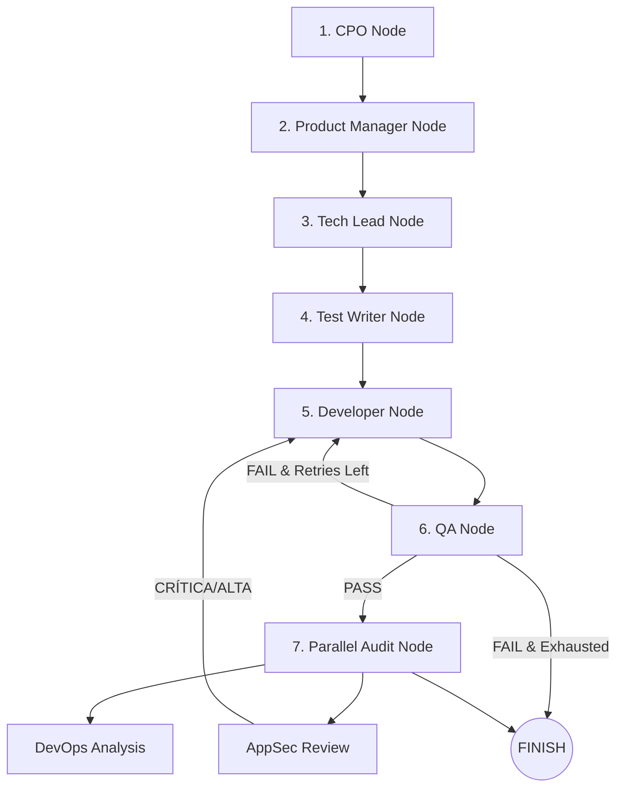

# LoopForge v6 — Architecture & Technical Specifications

## Overview

LoopForge é um orquestrador autônomo de governança de agentes de IA construído em Python 3.12+ utilizando **LangGraph** para orquestração de workflow com estado (`GraphState`), **Pydantic v2** para validação estrita de dados, **FastAPI** para API REST e WebSockets, e o harness **OpenCode** para execução e LLM routing.

---

## Module Map

```text
src/lf/
├── api/              # Servidor FastAPI REST, WebSockets e templates HTML
│   ├── app.py        # Endpoints /api/runs, /ws/streaming, background workers
│   ├── auth.py       # Autenticação via HTTP Basic e X-API-Key
│   ├── websocket_manager.py # Gerenciador de conexões WebSocket (broadcast)
│   └── schemas.py    # Schemas Pydantic de request/response
├── cli/              # Interface CLI Click (16 commandos)
│   ├── commands/     # run, serve, benchmark, resume, diff, explore, pr,
│   │                 # init, plan, status, release, completion, generate-tests,
│   │                 # audit, export, studio
│   └── main.py       # Registro centralizado de comandos core
├── config/           # Pydantic v2 schemas (LoopForgeConfig, TaskSchema, TechStack)
│   ├── schema.py     # Modelos Pydantic v2 com validação
│   ├── registry.py   # TechStackRegistry com 5 handlers (Python, Java, Rust, Go, JS/TS)
│   └── loader.py     # load_config() JSON/YAML
├── pipeline/         # LangGraph StateGraph, nodes, state
│   ├── graph.py      # build_graph(), entry_router(), should_retry(), NodeRegistry
│   ├── state.py      # GraphState TypedDict (32 campos)
│   ├── llm_factory.py# SQLiteLLMCache, compressão de prompt, call_openrouter_api
│   └── nodes/        # 9 nós dos agentes
│       ├── cpo.py            # → PM
│       ├── pm.py             # → Tech Lead
│       ├── tech_lead.py      # → Test Writer (decisão dinâmica de stack)
│       ├── test_writer.py    # → Developer (gera testes-contrato + inventário MODULES)
│       ├── developer.py      # → QA (geração multi-arquivo)
│       ├── qa.py             # → Parallel Audit (detecção automática de manifestos)
│       ├── parallel_audit.py # → AppSec + DevOps em paralelo via ThreadPoolExecutor
│       ├── appsec.py         # Scanner de segurança estático e auditoria LLM
│       ├── devops.py         # Análise de deployabilidade e CI/CD
│       └── lessons.py        # Função generate_lessons_md (NÃO é nó) — executada dentro do parallel_audit
├── orchestrator/     # Despacho de tarefas e criação de planos
│   ├── task_dispatcher.py # dispatch(), resume(), HITL handler, checkpoints SQLite
│   └── plan_creator.py    # Converte visão em TaskSchema[]
├── guardrails/       # Proteções de pipeline
│   ├── circuit_breaker.py # 3 guardas: falhas, iterações, custo máximo USD
│   └── security_scanner.py# Varredura estática de segurança
├── memory/           # Memória persistente
│   └── manager.py    # MemoryManager (lições aprendidas, handoff context)
├── telemetry/        # Telemetria SQLite e benchmark ELO rating system
│   ├── store.py            # Armazenamento de telemetria
│   ├── analytics.py        # Análise de métricas
│   ├── benchmark.py        # BenchmarkSuite com cálculo ELO
│   └── benchmark_dataset.py# 10 problemas curados multi-stack
└── runner/           # Subprocesso OpenCode, git runner e test harness
    ├── opencode/     # OpenCodeRunner (script -q -c, timeout default 300s configurável)
    ├── harness/      # TestHarnessRunner (auto-detecção de manifestos)
    └── git/          # checkpoint.py, pr.py, sandbox.py (worktrees)
```

---

## Fluxo de Dados e Pipeline

```text
lf run --idea "..."
       ↓
TaskDispatcher → initial_state (stack=None)
       ↓
build_graph() → StateGraph.invoke()
       ↓
CPO → PM → Tech Lead (decide stack) → Test Writer (gera testes-contrato) → Developer (gera multi-arquivos)
       ↓
QA (detecta & testa) → Parallel Audit (AppSec + DevOps; gera lessons.md + PROJECT_SUMMARY.md)
       ↓
FINISH / PR (gh pr create)
```

### Diagrama Mermaid



Nota: o gerador de lições (`generate_lessons_md`) **não é um nó** — é uma função executada dentro do nó `parallel_audit`, produzindo `lessons.md` e `PROJECT_SUMMARY.md`.

### Retry Logic (`should_retry`)

Após o nó QA (`graph.py:64-81`):

- **PASS** (0 testes falhos) → prossegue para `parallel_audit`
- **FAIL** com retries restantes (`qa_attempt_count < max_retries`) → retorna ao `developer`
- **FAIL** esgotado → `parallel_audit` mesmo assim, com o erro registrado **dentro do nó** (arestas condicionais não propagam mutação de estado)
- **AppSec com severidade CRÍTICA/ALTA** → `developer` novamente via aresta `parallel_audit: {developer, __end__}` (`graph.py:119`)

---

## Sub-pacotes do Ecossistema

Além do core `src/lf/`, o LoopForge inclui três pacotes independentes em `packages/`:

| Pacote | CLI | Função |
|---|---|---|
| **Genome** | `genome` | Codebase Genome — escaneia estrutura de diretórios, AST, métricas de dependência e calcula bus factor. Endpoint: `GET /api/genome` |
| **Registry** | `registry` | Agentic Interface Registry — rastreia contratos de interface entre agentes e detecta breaking changes. Endpoint: `GET /api/registry` |
| **Retro** | `retro` | Agentic Retro — síntese pós-sessão, extração de causas-raiz e recomendações de melhoria. Endpoint: `GET /api/retro` |

---

## Decisões de Design Principais

- **Decisão Dinâmica de Stack**: O Tech Lead analisa os requisitos e grava a melhor stack em `state["stack"]`. Se o usuário fornecer `--stack`, esta é usada como override.
- **Roteamento Centralizado no Grafo**: Arcos e transições definidos estritamente em `graph.py`.
- **Detecção Automática do QA**: Reconhecimento agnóstico de manifestos e executores (`pom.xml`, `Cargo.toml`, `go.mod`, `package.json`, `build.gradle`, `pyproject.toml`, `*.csproj`).
- **Auditoria Simultânea Paralela**: Nó `parallel_audit` executa `AppSec` e `DevOps` simultaneamente via `ThreadPoolExecutor` para otimização de tempo.
- **Isolamento de Sessão de Banco de Dados**: Trabalhadores assíncronos no FastAPI utilizam `session_factory()` próprio em corrotina background para evitar conflitos de concorrencia.
- **Cache Semântico e Compressão LLM**: Redução de custo via deduplicação de prompts e armazenamento local SQLite.

---

## Routing Modes Adaptativos

O `entry_router` em `graph.py:23` avalia `routing_mode` e `task_type` para decidir o ponto de entrada:

| Modo | Entrada | Gatilho |
|---|---|---|
| `full` | CPO → PM → Tech Lead → Dev → QA → Audit | `routing_mode="full"` (default) |
| `fast` / `patch` | Developer → QA → Audit | `task_type="bugfix"/"refactor"/"simple"` |
| `review-only` | QA → Parallel Audit | `task_type="review"` |
| `explore` | Tech Lead (spike) | `routing_mode="explore"` |

---

## Human-in-the-Loop (HITL)

Ativado via `--interactive`/`-i`. O `TaskDispatcher` habilita `human_gate_enabled=True` no `build_graph()`, que insere `NodeInterrupt` nos nós `developer`, `qa` e `parallel_audit`.

Ações disponíveis via `POST /api/runs/{id}/decide`:
- `approve` — prossegue com o resultado atual
- `retry` — reexecuta o nó
- `adjust_prompt` — ajusta o prompt e reexecuta (com `feedback_category` e `feedback_message`)
- `abort` — encerra a pipeline

Timeout padrão: **300s**, configurável via `ade.yaml` (`hitl.timeout_seconds`). Comportamento em timeout configurável via `ade.yaml` (`hitl.on_timeout`: `continue` | `abort` (default) | `pause`) — `task_dispatcher.py:107-118`.

Decisões registradas em `.loopforge/telemetry.sqlite` (tabela `human_decisions`).

---

## Guardrails & Circuit Breaker

Três guardas no `CircuitBreaker` (`guardrails/circuit_breaker.py`):

1. **Falhas Consecutivas**: Máximo de 5 falhas seguidas antes de abrir o circuito
2. **Iterações Máximas**: Limite de 20 chamadas totais
3. **Custo Máximo USD**: Gate por `max_total_cost` (default: $50.00, herdado de `budget_limit_usd` no `.loopforge.json`)

Estados: `closed` (ok) → `open` (bloqueado) → `half-open` (tentativa de recuperação após 300s).

Integrado ao `OpenCodeRunner.run()` e ao `TaskDispatcher.dispatch()` — verifica `can_proceed()` antes de cada execução.

---

## Memória Persistente

`MemoryManager` (`memory/manager.py`) armazena lições aprendidas (lessons) em `.loopforge/telemetry.sqlite` (default `TELEMETRY_DB_PATH`):

- Tabela: `lessons(id, run_id, stack, idea, lesson_text, created_at)`
- Indexado por `stack` para busca eficiente
- `search_relevant_lessons(query, stack, cross_project=...)` retorna top 3 por relevância (keyword scoring)
- `cross_project_enabled()` (`manager.py:17`) controla busca global entre projetos; quando ativo, `cross_project=True` ignora o filtro de stack
- Conteúdo injetado em prompts de novos runs via `format_lessons_for_prompt()`

---

## Autenticação da API

A API REST suporta dois métodos de autenticação via `auth.py`:

- **X-API-Key**: Header `X-API-Key` (configurado em `APISettings.api_key`)
- **HTTP Basic**: Username ou password como chave de API

Ativada apenas quando `require_auth=True` ou `api_key` está definida nas settings. WebSockets validam token via query parameter `?token=`.
