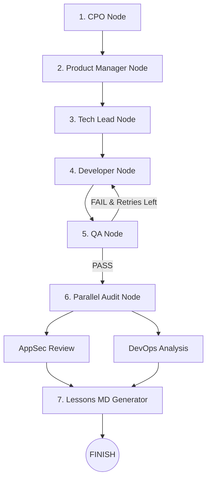

# Arquitetura do Pipeline de Agentes v6

O LoopForge orquestra o desenvolvimento autônomo através de uma máquina de estados **LangGraph** (`StateGraph`) com 7 papéis especializados:

## Papéis dos Agentes

1. **CPO (Chief Product Officer)**: Define a visão do produto e desdobra o objetivo em Epics (`EpicSchema`).
2. **Product Manager (PM)**: Quebra os epics em User Stories (`UserStoryList`) com critérios de aceite detalhados.
3. **Tech Lead**: Avalia os requisitos e decide autonomamente a melhor stack tecnológica (ex: `rust`, `java`, `python`, `go`, `javascript`) e elabora a arquitetura (`tech_spec`).
4. **Developer**: Gera projetos multi-arquivos autônomos (código principal, arquivo de build/manifesto e suítes de teste).
5. **QA (Quality Assurance)**: Inspeciona os arquivos gerados, detecta a stack e dispara o harness de testes (`mvn test`, `cargo test`, `pytest`, `npm test`, `go test`, `dotnet test`).
6. **Parallel Audit (AppSec + DevOps)**: Executa simultaneamente via `ThreadPoolExecutor` a auditoria de segurança estática (AppSec) e análise de deployabilidade/CI (DevOps).
7. **Lessons Generator**: Cria o artefato final `lessons.md` com o resumo executivo, contagem de retentativas, resultado do QA, avisos de segurança e instruções de execução.
