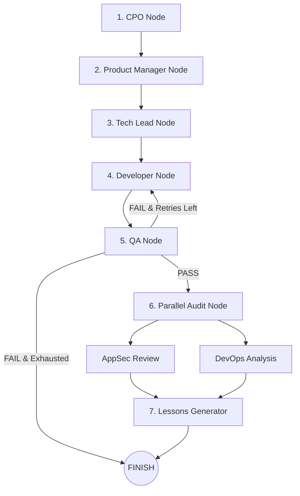

# Arquitetura do Pipeline de Agentes v6

O LoopForge orquestra o desenvolvimento autônomo através de uma máquina de estados **LangGraph** (`StateGraph`) com 9 nós de agente especializados:

## Routing Modes

O `entry_router` em `graph.py` decide o ponto de entrada baseado em `routing_mode` e `task_type`:

| Modo | Entrada | Uso |
|---|---|---|
| `full` | CPO → PM → Tech Lead → Dev → QA → Audit | Features completas (default) |
| `fast` / `patch` | Developer → QA → Audit | Bugfix, refactor, tarefas simples |
| `review-only` | QA → Parallel Audit | Revisão de código existente |
| `explore` | Tech Lead (spike) | Prova de conceito / pesquisa |

## Retry Logic (`should_retry`)

Após o nó QA:
- **PASS** (0 testes falhos) → prossegue para `parallel_audit`
- **FAIL** com retries restantes → retorna ao `developer`
- **FAIL** sem retries → `__end__` (pipeline encerrada)

## Papéis dos Agentes

1. **CPO (Chief Product Officer)**: Define a visão do produto e desdobra o objetivo em Epics (`EpicSchema`).
2. **Product Manager (PM)**: Quebra os epics em User Stories (`UserStoryList`) com critérios de aceite detalhados.
3. **Tech Lead**: Avalia os requisitos e decide autonomamente a melhor stack tecnológica (ex: `rust`, `java`, `python`, `go`, `javascript`) e elabora a arquitetura (`tech_spec`).
4. **Developer**: Gera projetos multi-arquivos autônomos (código principal, arquivo de build/manifesto e suítes de teste).
5. **QA (Quality Assurance)**: Inspeciona os arquivos gerados, detecta a stack e dispara o harness de testes (`mvn test`, `cargo test`, `pytest`, `npm test`, `go test`, `dotnet test`).
6. **Parallel Audit (AppSec + DevOps)**: Executa simultaneamente via `ThreadPoolExecutor` a auditoria de segurança estática (AppSec) e análise de deployabilidade/CI (DevOps).
7. **Lessons Generator**: Cria o artefato final `lessons.md` com o resumo executivo, contagem de retentativas, resultado do QA, avisos de segurança e instruções de execução.

## GraphState (57 campos)

O estado compartilhado `GraphState` (TypedDict em `state.py`) inclui:

- **Entrada**: `idea`, `output_dir`
- **Artefatos**: `epic`, `user_stories`, `tech_spec`, `code`, `test_report`, `security_review`, `devops_manifest`
- **Metadados**: `ontology_path`, `project_dir`, `stack`
- **Controle**: `next_agent`, `attempt_count`, `qa_attempt_count`, `max_retries`, `error`, `feedback_history`
- **LLM**: `mock_llm`, `llm_provider`, `llm_model_name`, `llm_temperature`
- **Modo**: `is_interactive`, `read_only`, `routing_mode`, `task_type`, `persona_id`, `expected_schema`

## NodeRegistry

O `NodeRegistry` em `graph.py` mantém um registro desacoplado de nós, permitindo extensão via `register(name, func)`. O `EdgeRegistry` gerencia as transições condicionais entre nós separadamente.
