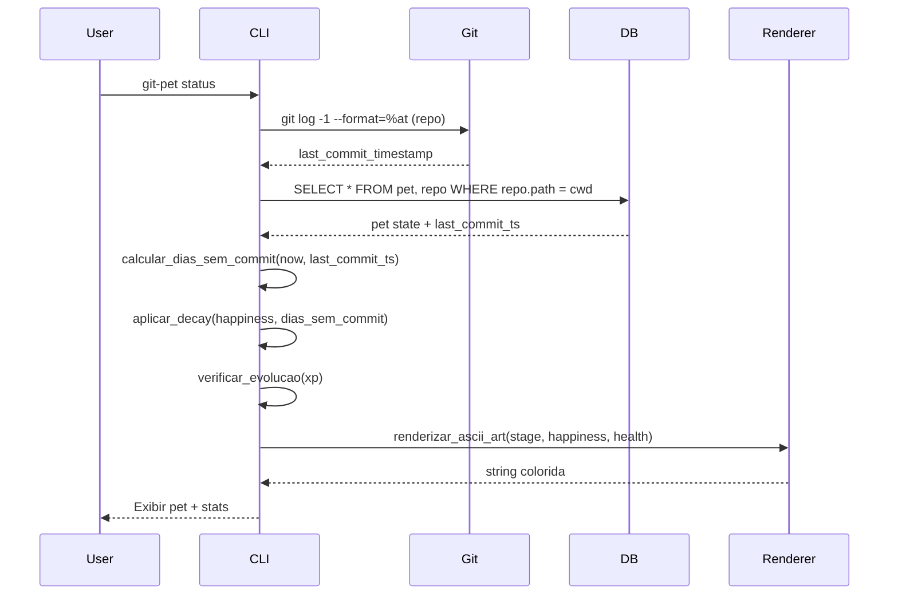
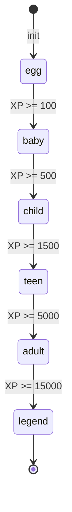
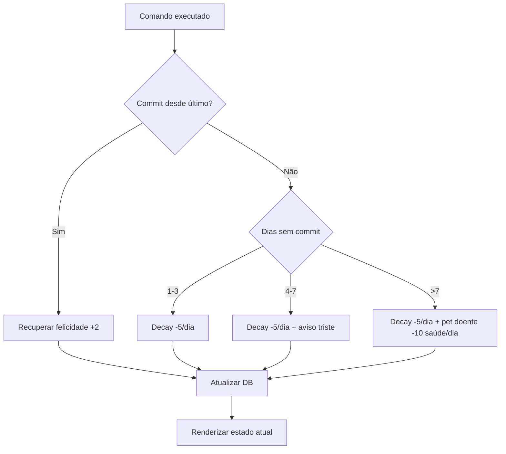

# Especificação Técnica: Git Tamagotchi (git-pet)

- **ID:** TS-001
- **User Story:** E-001-US001
- **Status:** Draft
- **Autor:** Tech Lead (LoopForge)
- **Revisores:** Especialista em Segurança, Tech Lead
- **Data da Última Atualização:** 2026-07-30

## 1. Visão Geral e Objetivo

O Git Tamagotchi é um utilitário CLI escrito em Rust que monitora repositórios Git locais e apresenta um bichinho virtual cujo estado reflete a atividade de commit do usuário. Se o usuário commita frequentemente, o pet ganha XP, evolui e exibe uma arte ASCII colorida animada. Se passam dias sem commit, o pet fica triste e/ou doente, incentivando o hábito de commitar. O projeto visa tornar o workflow de Git mais envolvente e fornecer feedback visual sobre a consistência do desenvolvedor.

### 1.1. Escopo

* **In Scope:**
  * Leitura de histórico de commits de repositórios Git locais via `git2`/libgit2.
  * Motor de estado do pet: níveis de XP, evolução ( Estágio 1 → Estágio N ), felicidade e saúde.
  * Comandos CLI: `status`, `feed`, `stats`, `reset`, `init`.
  * Exibição de arte ASCII colorida no terminal usando `owo-colors` ou `clicolors`.
  * Persistência do estado do pet em arquivo local (SQLite via `rusqlite` ou JSON via `serde_json`).
  * Cálculo de decay de felicidade baseado em dias sem commit.
* **Out of Scope:**
  * Integração com repositórios remotos (GitHub, GitLab API).
  * Multiplayer ou pets compartilhados entre usuários.
  * Interface gráfica (GUI/Web).
  * Notificações push ou integração com messaging apps.
  * Suporte a múltiplos pets simultâneos no mesmo repositório (v1 será single-pet).

## 2. Detalhes da Implementação

### 2.1. Modelo de Dados

O estado do pet será persistido em um arquivo SQLite localizado em `~/.git-pet/state.db` (ou o diretório configurável via `--data-dir`).

**Schema:**

```sql
CREATE TABLE pet (
    id              INTEGER PRIMARY KEY,
    name            TEXT NOT NULL DEFAULT 'GitPet',
    stage           TEXT NOT NULL DEFAULT 'egg',
    xp              INTEGER NOT NULL DEFAULT 0,
    xp_next_level   INTEGER NOT NULL DEFAULT 100,
    happiness       INTEGER NOT NULL DEFAULT 50,
    health          INTEGER NOT NULL DEFAULT 100,
    last_commit_ts  INTEGER NOT NULL,
    created_at      INTEGER NOT NULL,
    updated_at      INTEGER NOT NULL
);

CREATE TABLE repo (
    id            INTEGER PRIMARY KEY,
    path          TEXT NOT NULL UNIQUE,
    pet_id        INTEGER NOT NULL REFERENCES pet(id),
    auto_track    INTEGER NOT NULL DEFAULT 1
);
```

**Evolução (Stages):** `egg` → `baby` → `child` → `teen` → `adult` → `legend`. Cada estágio requer XP acumulado crescente.

**Estratégia de Migração:**
* Migração inicial: SQLite com schema acima, criado automaticamente no primeiro `git-pet init`.
* Atualizações de schema futuras usarão migrations versionadas no código (ex: `migrations/001_init.sql`, `migrations/002_add_feed_count.sql`).
* Migrações são idempotentes e aplicadas via `rusqlite` na inicialização.

### 2.1. Requisitos de Migração de Dados
* `last_commit_ts` será populado com o timestamp do commit mais recente do repositório no momento do `init`.
* A coluna `happiness` inicia em 50 (neutro) e é recalculada a cada comando `status` com base no decay.

### 2.2. Interface de CLI (Contrato de Comandos)

O Git Tamagotchi expõe os seguintes subcomandos via `clap` ( derive macros ):

**`git-pet init [--repo <PATH>]`**
* **Descrição:** Inicializa o pet para um repositório Git. Cria o banco de dados e registra o repositório.
* **Args:**
  * `--repo <PATH>` — Caminho do repositório Git (padrão: cwd).
* **Response (Exit 0):** Pet criado com estágio `egg`, XP 0.
* **Response (Exit 1):** Erro — diretório não é um repositório Git válido.

**`git-pet status`**
* **Descrição:** Verifica o estado atual do repositório monitorado e exibe o pet com arte ASCII atualizada.
* **Auth:** Nenhuma (CLI local).
* **Response:** Arte ASCII colorida + nível do pet, XP, felicidade, saúde, dias sem commit.

**`git-pet feed`**
* **Descrição:** "Alimenta" o pet, restaurando saúde e felicidade. Consome uma ação do dia (limite diário).
* **Response (200):** Pet alimentado. Felicidade +20, Saúde +30 (cap no máximo 100).
* **Response (429):** Limite diário de feeds já atingido (3 por dia).

**`git-pet stats`**
* **Descrição:** Exibe estatísticas detalhadas do pet e do histórico de commits.
* **Response:** Total de commits, streak atual, dias sem commit, evolução alcançada, histórico de XP.

**`git-pet reset`**
* **Descrição:** Reseta o pet para o estado inicial (estágio `egg`, XP 0). Pede confirmação interativa.
* **Response:** Pet reiniciado.

**`git-pet track [--enable|--disable]`**
* **Descrição:** Ativa/desativa o tracking automático de commits para o repositório atual.
* **Response:** Status de tracking atualizado.

### 2.3. Lógica de Negócio e Algoritmos

**2.3.1. Sistema de XP**
* XP é concedido por commits detectados no repositório monitorado.
* Fórmula de XP por commit: `base_xp = 10 + (commits_no_dia * 2)` (bônus por streak diário, máximo 50 XP/dia).
* XP acumulado determina o estágio do pet:
  * `egg`: 0 XP
  * `baby`: 100 XP
  * `child`: 500 XP
  * `teen`: 1500 XP
  * `adult`: 5000 XP
  * `legend`: 15000 XP

**2.3.2. Decay de Felicidade**
* Felicidade decai 5 pontos por dia sem commit, mínimo em 0.
* Felicidade recupera 2 pontos por commit realizado.
* Se felicidade < 20 por 3+ dias consecutivos, saúde começa a decair (-10/dia adicional).
* Se saúde < 0, o pet fica "desmaiado" e não ganha XP até ser "alimentado".

**2.3.3. Cálculo de Streak**
* Streak = número de dias consecutivos com ≥1 commit até a data atual.
* Um dia sem commit quebra o streak.

**2.3.4. Detecção de Novos Commits**
* No comando `status`, o tool consulta o commit mais recente via `git log -1 --format=%at`.
* Compara com `last_commit_ts` no banco. Se diferente e mais recente, processa como novo commit.
* Usa polling (não hooks) para simplicidade — o estado só atualiza quando o usuário executa um comando.

**2.3.5. Limites**
* Feed limit: 3 usos por dia (reset à meia-noite UTC).
* Máximo de 100 XP/dia (cap).

## 3. Fluxos e Diagramas

### 3.1. Fluxo Principal: `status`



### 3.2. Fluxo de Evolução



### 3.3. Fluxo de Decay de Felicidade



## 4. Requisitos Não-Funcionais & Operação

### 4.1. Segurança
* **Permissões de Sistema:** O tool lê apenas repositórios Git locais do usuário. Não faz networking. Não acessa dados remotos.
* **Dados Sensíveis:** O banco SQLite armazena apenas estado do pet e caminhos de repositório (sem PII de commits). O diretório de dados (`~/.git-pet/`) tem permissões `0o700`.
* **Injection:** Inputs de caminho são validados e normalizados antes de uso em queries SQL (parametrized queries com `rusqlite`).

### 4.2. Performance e Escalabilidade
* **Latência Esperada:** < 100ms para qualquer comando CLI (local SQLite + leitura git log).
* **Carga:** Uso single-user, single-threaded. Nenhuma necessidade de cache extra ou concorrência.
* **Memory:** RSS < 10MB (Rust é adequado para isso).
* **Startup:** Cold start < 50ms.

### 4.3. Observabilidade
* **Logs:** Logs em nível `INFO` e `ERROR` escritos em `~/.git-pet/pet.log`. Formato: `[TIMESTAMP][LEVEL] message`.
* **Métricas:** Logs internos para: tempo de execução por comando, contagem de commits detectados, eventos de evolução, eventos de decay de saúde.
* **Error Reporting:** Erros de git (repo não encontrado, branch quebrada) exibidos em mensagens claras ao usuário, não em stack traces.

## 5. Estratégia de Lançamento (Rollout) & Riscos

### 5.1. Requisitos de Deploy
* **Build:** `cargo build --release` → binário estático `git-pet`.
* **Instalação:** Instalável via `cargo install git-pet` ou binário standalone.
* **Primeiro uso:** `git-pet init` cria o diretório de dados e o banco SQLite automaticamente.
* **Dependências de runtime:** Nenhuma além de libgit2 dinâmica (bundled via cargo) em Linux.

### 5.2. Requisitos de Rollback
* O estado do pet é persistente em SQLite. Rollback do binário não afeta dados.
* Se o schema mudar, migrations são versionadas e aplicadas em ordem crescente. Não é possível reverter para um schema mais antigo sem script manual de downgrade.
* Em caso de corrupção do banco, `git-pet reset` destrói e recria o banco do zero (último recurso).

### 5.3. Riscos e Edge Cases
* **Repositório Git corrompido:** Se `git log` falhar, exibir mensagem de erro amigável e sugerir `git fsck`.
* **Múltiplos repositórios no mesmo diretório de dados:** O registro no banco é por caminho absoluto. O mesmo repositório em caminhos diferentes (symlinks) será tratado como repositórios distintos.
* **Concorrência:** Se o usuário executar `git-pet` de múltiplas shells simultaneamente, o SQLite handle locking via WAL mode. Reads não são bloqueados. Writes com retry (3 tentativas).
* **Sistemas sem git instalado:** Exibir erro claro: "git não encontrado. Instale git antes de usar git-pet."
* **Branches sem commits:** Ao `init` em repo vazio, pet inicia como `egg` com `last_commit_ts = 0`.
* **Fuso horário:** Todos os timestamps Unix UTC internamente. Decay de felicidade calculado por dias corridos UTC.

## 6. Alternativas Consideradas

* **JSON vs SQLite para persistência:** Escolhemos SQLite por consistência transacional (evita corrupção em crash mid-write) e capacidade de queries eficientes para cálculo de streaks e histórico. JSON seria suficiente para v1, mas SQLite melhor para futuras features de histórico.
* **Polling vs Git Hooks:** Escolhemos polling (detecção no comando) ao invés de hooks Git (post-commit). Hooks exigem instalação em cada repo, são mais difíceis de manter e podem causar conflitos com ferramentas existentes. Polling é transparente e zero-config.
* **Arte ASCII vs Emoji:** Inicialmente consideramos emojis Unicode, mas descartamos por problemas de renderização em terminais antigos e inconsistência de rendering entre plataformas. Arte ASCII é portável e previsível.
* **`git2` crate vs `std::process::Command("git")`:** Escolhemos a crate `git2` (bindings para libgit2) por acesso programático ao histórico de commits sem shell spawning, melhor performance e manipulação de erros granular. `std::process::Command` seria mais simples mas menos robusto.