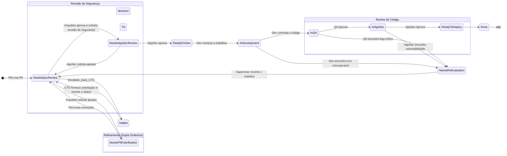

# Princípios do Ecossistema de Agentes

Este documento define os princípios arquitetônicos fundamentais que governam a operação e a comunicação dentro do nosso ecossistema de agentes de IA.

## Nome do Sistema: Ecossistema

Chamamos nosso sistema de "Ecossistema" para refletir sua natureza: uma coleção de agentes especialistas e independentes que interagem e colaboram para atingir um objetivo comum. Cada agente tem seu próprio contexto e responsabilidades, mas seu valor é maximizado através de suas interações dentro do ecossistema.

## Princípio 1: Comunicação e Tarefas via Git (Git-Native Workflow)

A comunicação entre agentes e a gestão de tarefas são realizadas através de um fluxo de trabalho baseado em Git em um repositório dedicado (`work_items`).
*   **Unidade de Trabalho:** Cada tarefa é uma branch de longa duração.
*   **Artefatos:** Os produtos gerados por cada agente são arquivos com schemas bem definidos, commitados na branch da tarefa.
*   **Hand-off e Status:** A passagem de tarefas é feita via Pull Requests (PRs), utilizando labels e assignees para gerenciar o estado.
*   **Vantagens:** Garante Rastreabilidade, Versionamento e Rollback, tratando o fluxo de trabalho como código (Workflow as Code).

## Princípio 2: Contratos de Dados Explícitos

A comunicação entre agentes é previsível através de schemas de I/O definidos no `Protocolo_Comunicacao` de cada persona e implementados com Pydantic no LangGraph.

## Princípio 3: Ciclo de Vida de uma Tarefa (Máquina de Estados)

Toda tarefa segue um ciclo de vida gerenciado por labels de status em um PR.
**Diagrama de Estados com Rollback:**

## Princípio 4: Governança e Revisão Estratégica

A liderança pode intervir no processo de forma estruturada.
*   **Mecanismo:** Feedbacks estratégicos (ex: do CEO) são direcionados ao `CTO`.
*   **Ação:** O `CTO` traduz o feedback em diretrizes técnicas e atua como revisor em PRs que necessitam de alinhamento estratégico (com a label `status:needs-technical-review`).

## Princípio 5: Gestão de Conhecimento e Aprendizado Contínuo

O ecossistema aprende com seu histórico para evitar a repetição de erros.
*   **Architectural Decision Records (ADRs):** Para cada decisão de arquitetura significativa, o `Arquiteto` cria um ADR.
*   **Post-Mortem Reports:** Para cada bug crítico resolvido, o `Tech Lead` orquestra a criação de um relatório de post-mortem.
*   **Ciclo de Aprendizagem:** As personas são instruídas a consultar ADRs e Post-Mortems relevantes antes de iniciar novas tarefas.

## Princípio 6: Padrão de Labels do Git

Um padrão de labels é usado para gerenciar o "dashboard" de Pull Requests.
### `status:`
*   `status:needs-spec-review`
*   `status:needs-pm-clarification`
*   `status:needs-technical-review`
*   `status:ready-for-dev`
*   `status:in-development`
*   `status:in-qa`
*   `status:in-appsec`
*   `status:needs-work` (rejeitado, de volta ao Dev)
*   `status:needs-re-evaluation` (falha crítica, para o Arquiteto)
*   `status:error-halted` (requer intervenção do Supervisor)
*   `status:ready-for-deploy`
*   `status:done`
*   `(Futuro) status:loop-detected`

### `priority:`
*   `priority:critical`, `priority:high`, `priority:medium`, `priority:low`

### `type:`
*   `type:feature`, `type:bug`, `type:chore`, `type:adr`, `type:postmortem`

## Princípio 7: Sagas de Workflow e Rollbacks

Nosso fluxo de trabalho implementa o Padrão Saga para garantir resiliência.
*   **Transação de Compensação (Rollback):** Se uma tarefa entra em `status:error-halted`, um agente `Supervisor` é acionado. Ele executa um `git revert` para desfazer os commits da etapa falha e restaura o PR para um estado anterior seguro (ex: `status:needs-re-evaluation`), notificando o líder da equipe.