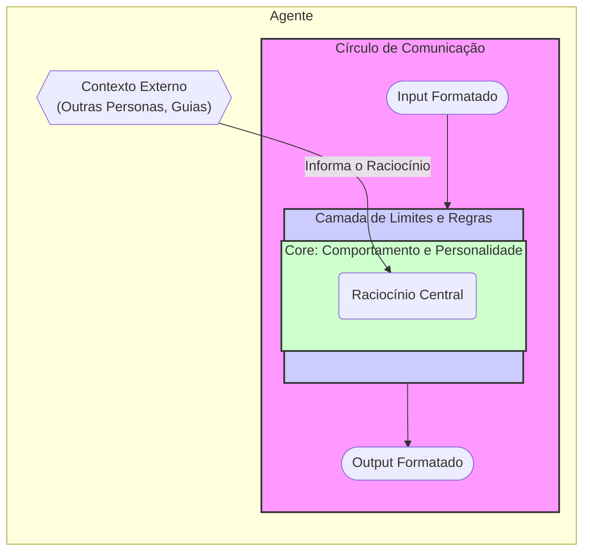

# Sua Visão de Agente (Modelo Hierárquico de Camadas)

Este modelo representa sua visão de um agente com camadas de responsabilidade, contexto e comunicação.

```mermaid
graph TD
    style Comunicacao fill:#f9f,stroke:#333,stroke-width:2px
    style Limites fill:#ccf,stroke:#333,stroke-width:2px
    style Persona fill:#cfc,stroke:#333,stroke-width:2px

    subgraph Agente
        direction TB
        subgraph Comunicacao [Círculo de Comunicação]
            direction LR
            Input([Input Formatado]) --> Limites;
            Limites --> Output([Output Formatado]);
        end

        subgraph Limites [Camada de Limites e Regras]
             Persona
        end

        subgraph Persona [Core: Comportamento e Personalidade]
            P(Raciocínio Central)
        end

        Contexto{{"Contexto Externo <br/> (Outras Personas, Guias)"}} --"Informa o Raciocínio"--> P;
    end
```