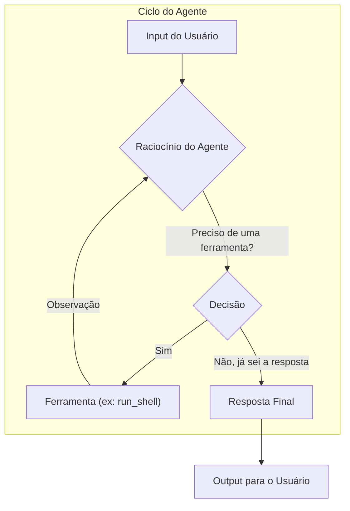

# Modelo de Agente "Padrão de Mercado" (Ex: ReAct)

Este modelo representa um ciclo simples de Raciocínio e Ação.

```mermaid
graph TD
    subgraph "Ciclo do Agente"
        A[Input do Usuário] --> B{Raciocínio do Agente};
        B --"Preciso de uma ferramenta?"--> C{Decisão};
        C --"Sim"--> D["Ferramenta (ex: run_shell)"];
        D --"Observação"--> B;
        C --"Não, já sei a resposta"--> E[Resposta Final];
    end
    E --> F[Output para o Usuário];
```