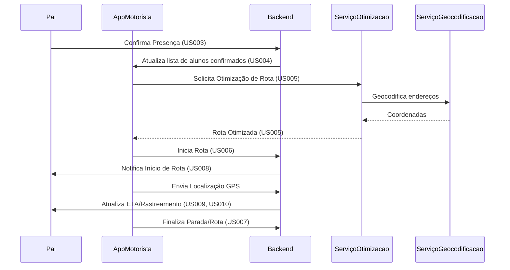

# Especificação Técnica: Plataforma de Gestão de Rotas - Épico E-001

- **ID:** E-001-TS001
- **User Story:** E-001-US001, E-001-US002, ..., E-001-US012
- **Status:** Draft (MOCK)
- **Autor:** Tech Lead Bot (MOCK)
- **Revisores:** Especialista em Segurança, Tech Lead
- **Data da Última Atualização:** 2025-12-29

## 1. Visão Geral e Objetivo
Este documento detalha a abordagem técnica para a Plataforma de Gestão de Rotas e Comunicação para Motoristas de Van Escolar, focando em automação de presença, otimização de rotas e comunicação em tempo real. O objetivo é aumentar a eficiência do motorista e a satisfação dos pais/alunos.

### 1.1. Escopo
* **In Scope:** Implementação das User Stories aprovadas (E-001-US001 a E-001-US012).
* **Out of Scope:** Funcionalidades de pagamento, gestão multi-motorista, integração com sistemas escolares.

## 2. Detalhes da Implementação

### 2.1. Alterações no Modelo de Dados
Novo modelo `Aluno` (nome, endereço, lat/long, telefone responsável, id_escola).
Novo modelo `Rota` (motorista_id, data, alunos_confirmados, sequencia_paradas, status).
Novo modelo `Parada` (rota_id, aluno_id, endereco, lat/long, eta_previsto, eta_real, status).
* **Schema Changes:** Criação de tabelas `Alunos`, `Rotas`, `Paradas`.
* **Estratégia de Migração:** Migrações incrementais via ferramenta de ORM (ex: Alembic, Liquibase).

### 2.2. Interface de API (Contrato)
* **`POST /api/v1/alunos`**
    * **Auth:** JWT (Motorista)
    * **Request Payload:** `{ "nome": "...", "endereco": "...", "telefone_responsavel": "..." }`
    * **Response (200 OK):** `{ "id": "...", "nome": "..." }`
* **`GET /api/v1/rotas/{rota_id}/rastreamento`**
    * **Auth:** JWT (Pais, Alunos)
    * **Response (200 OK):** `{ "localizacao_van": { "lat": ..., "long": ... }, "eta_paradas": [...] }`

### 2.3. Lógica de Negócio e Algoritmos
* **Confirmação de Presença:** Sistema de notificações e interface para pais. Padrão: Ausente se não confirmado após deadline.
* **Otimização de Rota:** Algoritmo de roteamento (ex: OpenStreetMap + heurística do caixeiro viajante) baseado em alunos confirmados.
* **Rastreamento e ETA:** GPS do dispositivo do motorista, cálculo de ETA com base em dados de tráfego (API externa).

## 3. Fluxos e Diagramas

## 4. Requisitos Não-Funcionais & Operação

### 4.1. Segurança
*   **Autenticação/Autorização:** JWT para motoristas e pais. Papéis definidos para acesso a dados.
*   **Dados Sensíveis:** Endereços, nomes de alunos. Criptografia em repouso e em trânsito. PII não logado.

### 4.2. Performance e Escalabilidade
*   **Latência Esperada:** Geração de rota < 5s. Atualização de localização < 10s.
*   **Carga:** Suporte a 1000 rotas ativas simultaneamente. Uso de cache (Redis) para dados de rota.

### 4.3. Observabilidade
*   **Logs:** Logs estruturados (JSON) para eventos de rota, login, notificações.
*   **Métricas:** Taxa de sucesso de otimização, tempo de resposta de APIs, latência de notificações, uso de CPU/Memória.

## 5. Estratégia de Lançamento (Rollout) & Riscos

### 5.1. Requisitos de Deploy
*   Containerização (Docker). Orquestração via Kubernetes. Feature Flags para novas funcionalidades.
### 5.2. Requisitos de Rollback
*   Desativação de Feature Flags. Migrações de DB reversíveis (se possível).
### 5.3. Riscos e Edge Cases
*   Perda de sinal GPS do motorista. Dados de tráfego desatualizados. Aumento inesperado de usuários/rotas.

## 6. Alternativas Consideradas (Opcional)
*   **Otimização de Rotas:** Google Maps API (custo), OpenRouteService (open-source). Escolha baseada em custo vs. flexibilidade.
*   **DB:** PostgreSQL (flexibilidade, escalabilidade) vs. DynamoDB (alta performance para casos específicos). PostgreSQL inicialmente.
