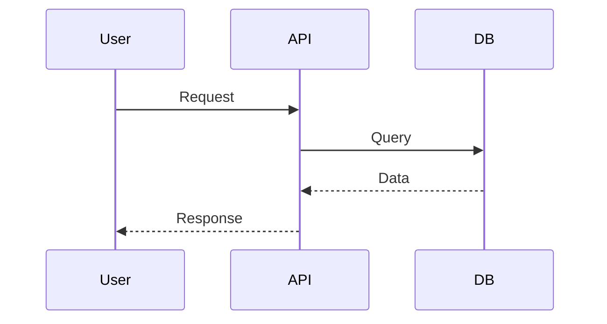

# Especificação Técnica: [Título da User Story]

- **ID:** [ID da Spec - Ver `id_conventions.json` (tech_spec)]
- **User Story:** [ID da User Story relacionada - ex: US-XXX]
- **Status:** [Draft | Em Revisão | Aprovado | Obsoleto]
- **Autor:** [Nome do Arquiteto/Dev Sênior]
- **Revisores:** [Especialista em Segurança], [Tech Lead]
- **Data da Última Atualização:** [YYYY-MM-DD]

## 1. Visão Geral e Objetivo
*Descreva o problema de negócio que estamos resolvendo e a abordagem técnica de alto nível. (Ex: "Vamos migrar o checkout para um microsserviço para isolar falhas de pagamento").*

### 1.1. Escopo
* **In Scope:** O que será entregue nesta tarefa.
* **Out of Scope:** O que explicitamente NÃO será feito agora (para evitar scope creep).

## 2. Detalhes da Implementação

### 2.1. Alterações no Modelo de Dados
*Descreva novas tabelas, colunas, índices ou migrações necessárias.*
* **Schema Changes:** (Ex: `ALTER TABLE users ADD COLUMN...`)
* **Estratégia de Migração:** (Ex: "A coluna será criada como nullable primeiro, depois populada via script").
* **2.1. Requisitos de Migração de Dados:**
    *   *O Arquiteto define o que precisa ser migrado. O DevOps detalhará como.*
    *   Ex: "A nova coluna `user_uuid` na tabela `users` deve ser populada com um UUID v4 único para cada usuário existente. A migração deve ser reversível."

### 2.2. Interface de API (Contrato)
*Para cada novo endpoint ou alteração:*
* **`METHOD /path/to/resource`**
    * **Auth:** (Ex: Bearer Token, Escopo necessário)
    * **Request Payload:** (JSON Schema ou exemplo)
    * **Response (200 OK):** (JSON Schema ou exemplo)
    * **Response (Erros Esperados):** (Ex: 400 se validação falhar, 409 se conflito).

### 2.3. Lógica de Negócio e Algoritmos
*Detalhe regras complexas, validações específicas ou fórmulas.*

## 3. Fluxos e Diagramas
*Use Mermaid para ilustrar fluxos complexos.*

## 4. Requisitos Não-Funcionais & Operação

### 4.1. Segurança
*   **Autenticação/Autorização:** Quem pode acessar?
*   **Dados Sensíveis:** PII (Dados Pessoais) estão sendo logados ou salvos? (GDPR/LGPD).

### 4.2. Performance e Escalabilidade
*   **Latência Esperada:** (Ex: < 200ms)
*   **Carga:** Quantas req/s esperamos? Precisamos de cache (Redis)?

### 4.3. Observabilidade
*   **Logs:** O que precisa ser logado para debug?
*   **Métricas:** Quais métricas de negócio ou técnicas vamos monitorar? (Ex: "Taxa de falha no pagamento").

## 5. Estratégia de Lançamento (Rollout) & Riscos

### 5.1. Requisitos de Deploy
*   *O Arquiteto define o que é necessário para o deploy. O DevOps detalhará o plano.*
*   Ex: "O código será protegido por uma Feature Flag chamada `feature-new-vendas`. O rollout inicial deve ser para 10% dos usuários."

### 5.2. Requisitos de Rollback
*   *O Arquiteto define o que é necessário para o rollback. O DevOps detalhará o plano.*
*   Ex: "O rollback deve ser possível via desativação da Feature Flag. A migração de dados associada não é reversível e exigirá um script manual de 'downgrade' a ser preparado pelo DevOps."

### 5.3. Riscos e Edge Cases
*   O que pode dar errado? (Ex: "Se o serviço de terceiros cair, o usuário verá uma mensagem amigável ou um erro 500?").
*   Considerações de concorrência?

## 6. Alternativas Consideradas (Opcional)
*Breve nota sobre por que escolhemos X e não Y. (Ex: "Escolhemos DynamoDB em vez de Postgres pela necessidade de escala de escrita...").*
