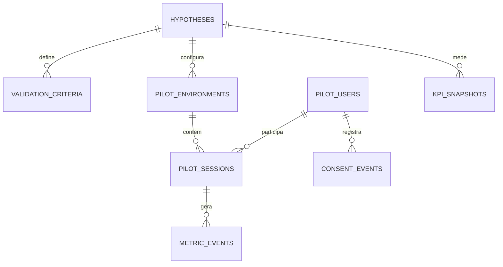
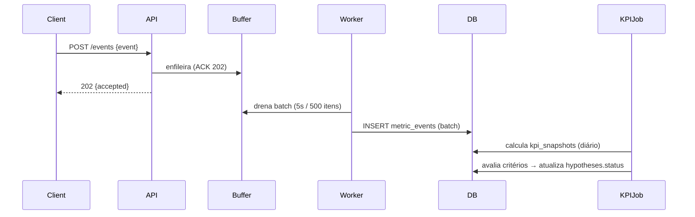

# Especificação Técnica: Plataforma de Validação via Teste Piloto (PilotCore)

- **ID:** TS-001
- **User Story:** E-001 (Épico de Validação do Produto) — US: E-001-US001, E-001-US002, E-001-US003, E-001-US004, E-001-US005
- **Status:** Draft
- **Autor:** Lucas Damasceno (Arquiteto/Dev Sênior)
- **Revisores:** Especialista em Segurança, Tech Lead
- **Data da Última Atualização:** 2026-08-08

## 1. Visão Geral e Objetivo

O produto ainda não tem validação empírica da sua hipótese central de valor. Estamos investindo em *build* guiado por suposições, sem evidência quantitativa ou qualitativa de que o problema vale ser resolvido.

Vamos construir um **módulo de validação por teste piloto** (PilotCore) que formaliza o ciclo *hipótese → critérios → recrutamento → ambiente → métricas*. Ele permitirá ao time definir a hipótese central de valor, declarar critérios de sucesso quantitativos e qualitativos, recrutar e gerenciar um grupo piloto inicial, configurar a jornada de teste (feature flags, ambiente) e coletar métricas de uso de forma padronizada. Com isso, a decisão de *go/no-go* será baseada em dados, não em intuição.

Abordagem técnica de alto nível: **monólito modular FastAPI (Python 3.12)** com camadas *core → services → repositories → api*, persistência relacional em **PostgreSQL**, migrações **Alembic**, ingestão de métricas via **eventos assíncronos** (buffer em memória + batch), consentimento LGPD rastreável e painel administrativo via REST.

### 1.1. Escopo

* **In Scope:**
  * Cadastro e versionamento da hipótese central de valor (E-001-US001).
  * Declaração de critérios de validação quantitativos (KPIs, limiares) e qualitativos (perguntas, sinais) (E-001-US002).
  * Recrutamento e gestão de coorte piloto: cadastro, convite, consentimento e status (E-001-US003).
  * Configuração do ambiente piloto: ativação de feature flags, definição da jornada de teste e sessões piloto (E-001-US004).
  * Ingestão e agregação de métricas quantitativas de uso (eventos) com cálculo de aderência aos critérios (E-001-US005).
  * API REST + autenticação JWT com RBAC (admin/analista/piloto).
  * Tratamento de LGPD: consentimento explícito, anonimização de PII em métricas.

* **Out of Scope:**
  * Engine de experimentação A/B completo (multi-variação, amostragem estatística avançada).
  * Plataforma de entrevistas/análise qualitativa (apenas registramos os critérios e coletamos os sinais via formulários simples).
  * BI/Data Warehouse e dashboards de alta complexidade.
  * Pagamentos/faturamento.
  * Aplicativo móvel nativo.
  * Escala de produção massiva (o foco é uma coorte piloto, não milhões de usuários).

## 2. Detalhes da Implementação

### 2.1. Alterações no Modelo de Dados

Banco: **PostgreSQL 16** (via SQLAlchemy 2.x + Alembic). Todas as tabelas novas; nenhuma alteração destrutiva em tabelas existentes.

| Tabela | Descrição | Chaves/Índices |
|---|---|---|
| `hypotheses` | Hipótese central de valor, versionável. | PK `id` (UUID v4), `status`, `version`, índice único `(code, version)`. |
| `validation_criteria` | Critérios quantitativos/qualitativos vinculados a uma hipótese. | PK `id`, FK `hypothesis_id`, `type` (`quantitative`/`qualitative`), `threshold` (nullable). |
| `pilot_users` | Participantes da coorte piloto. | PK `id`, `email_normalized` único, `status` (`invited`/`consented`/`active`/`dropped`), índice em `status`. |
| `consent_events` | Registro imutável de consentimento LGPD (append-only). | PK `id`, FK `pilot_user_id`, `version`, `signed_at`. |
| `pilot_environments` | Ambiente configurado para a jornada piloto. | PK `id`, FK `hypothesis_id`, `feature_flags` (JSONB), `journey_config` (JSONB). |
| `pilot_sessions` | Sessão de teste de um usuário em um ambiente. | PK `id`, FK `pilot_user_id`, FK `environment_id`, `started_at`, `ended_at`, índice em `started_at`. |
| `metric_events` | Evento bruto de uso (append-only, sem PII). | PK `id`, FK `session_id`, `event_name`, `properties` (JSONB), `occurred_at`, índice composto `(event_name, occurred_at)`. |
| `kpi_snapshots` | Agregações periódicas de KPIs por hipótese. | PK `id`, FK `hypothesis_id`, `metric_name`, `value`, `window_start`, `window_end`, único `(hypothesis_id, metric_name, window_start)`. |

* **Schema Changes:** todas as tabelas acima são `CREATE TABLE` novas. Sem `ALTER` em tabelas existentes.
* **Estratégia de Migração:** migrações Alembic numeradas e **idempotentes**. Como é greenfield (módulo novo), não há backfill; o único dado de seed é a hipótese inicial (via migration de dados `insert` idempotente por `code`).
* **2.1. Requisitos de Migração de Dados:**
  * A hipótese inicial definida pelo time (E-001-US001) deve ser inserida como `version=1`, `status=draft`, via migration de seed reversível (`downgrade` remove apenas registros com `code` de seed).
  * Nenhuma migração deve remover colunas/tabelas de outras features; o módulo é aditivo.

**Diagrama ER (resumo):**



### 2.2. Interface de API (Contrato)

Base URL: `/api/v1`. Todas as rotas exigem `Authorization: Bearer <JWT>`. Formato de erro uniforme: `{"code": "<string>", "message": "<string>", "details": {...}}`.

#### Hipóteses e Critérios

* **`POST /hypotheses`** — criar hipótese.
  * **Auth:** `admin` ou `analyst`.
  * **Request Payload:**
    ```json
    { "code": "HYP-001", "statement": "Usuários pagarão por automação de X porque economizam Y horas/semana.", "assumptions": ["..."] }
    ```
  * **Response (201):** `{ "id": "uuid", "version": 1, "status": "draft", "code": "HYP-001" }`.
  * **Erros:** `400` (validação), `409` (code duplicado).

* **`POST /hypotheses/{id}/criteria`** — declarar critérios de validação.
  * **Auth:** `admin` ou `analyst`.
  * **Request Payload:**
    ```json
    [
      { "type": "quantitative", "name": "dau_retention_d7", "threshold": 0.25, "comparator": "gte" },
      { "type": "qualitative", "name": "willingness_to_pay", "prompt": "Você pagaria R$49/mês por isso?" }
    ]
    ```
  * **Response (201):** lista de critérios criados com `id`.
  * **Erros:** `400` (threshold inválido para qualitativo), `404` (hipótese inexistente).

#### Recrutamento e Consentimento

* **`POST /pilot/users`** — cadastrar/enviar convite a participante.
  * **Auth:** `admin`.
  * **Request Payload:**
    ```json
    { "email": "piloto@example.com", "channel": "manual", "cohort_metadata": { "segment": "freelancer" } }
    ```
  * **Response (201):** `{ "id": "uuid", "email_normalized": "...", "status": "invited" }`.
  * **Erros:** `400` (email inválido), `409` (já cadastrado).

* **`POST /pilot/users/{id}/consent`** — registrar consentimento explícito (LGPD).
  * **Auth:** `admin` (registro mediado) — o dado é assinado com timestamp e versão da política.
  * **Request Payload:** `{ "policy_version": "2026-08-01", "signature_hash": "sha256..." }`.
  * **Response (201):** evento de consentimento persistido; `pilot_users.status → consented`.
  * **Erros:** `400` (policy_version ausente).

#### Ambiente e Jornada

* **`POST /pilot/environments`** — configurar ambiente/jornada do teste.
  * **Auth:** `admin`.
  * **Request Payload:**
    ```json
    { "hypothesis_id": "uuid", "feature_flags": { "pilot_flow_v2": true }, "journey_config": { "onboarding_steps": ["signup", "first_task", "value_reveal"] }, "starts_at": "2026-08-15T00:00:00Z", "ends_at": "2026-09-15T00:00:00Z" } }
    ```
  * **Response (201):** `{ "id": "uuid", "status": "scheduled" }`.
  * **Erros:** `400` (janela inválida), `404` (hipótese inexistente).

#### Métricas

* **`POST /events`** — ingestão de eventos de uso (enviado pelo client).
  * **Auth:** Bearer de sessão piloto (scope `pilot:event`), NÃO admin.
  * **Request Payload:**
    ```json
    { "session_id": "uuid", "event_name": "task_completed", "occurred_at": "2026-08-08T12:00:00Z", "properties": { "task_type": "automation", "duration_ms": 4200 } }
    ```
  * **Response (202):** `{ "accepted": true, "event_id": "uuid" }`.
  * **Erros:** `400` (payload inválido), `401` (sem scope), `409` (evento duplicado por idempotency key `idempotency_key`).

* **`GET /hypotheses/{id}/metrics`** — agregados e aderência aos critérios.
  * **Auth:** `admin` ou `analyst`.
  * **Response (200):**
    ```json
    { "hypothesis_id": "uuid", "metrics": { "dau_retention_d7": { "value": 0.31, "threshold": 0.25, "passed": true } }, "cohort_size": 42, "active_sessions": 18 }
    ```

### 2.3. Lógica de Negócio e Algoritmos

* **Versionamento de hipóteses:** alterar `statement` de uma hipótese ativa cria `version+1` em estado `draft`; hipóteses usadas por `kpi_snapshots` nunca são editadas in-place (imutabilidade de evidência).
* **Normalização de email:** email é normalizado para comparação (lowercase + strip), mas o `email` original é armazenado de forma reversível apenas em `pilot_users`; nunca entra em `metric_events`.
* **Cálculo de KPI de retenção (D7):** `dau_retention_d7 = |usuários com ≥1 sessão ativa no dia 7| / |usuários com sessão no dia 0|`, calculado em job diário (APScheduler) e persistido em `kpi_snapshots`. Limiar avaliado com `comparator` (`gte`, `lte`, `gt`, `lt`).
* **Avaliação de hipótese:** uma hipótese é `validated` quando **100% dos critérios quantitativos** passam **e** há registro qualitativo de pelo menos 1/3 da coorte respondendo aos prompts. Caso contrário, `rejected` ou `pending`, conforme janela da hipótese.
* **Idempotência de eventos:** a chave `idempotency_key` (SHA256 de `session_id + event_name + client_ts`) evita duplicação em retries do client; violação gera `409` com o evento original.
* **Anonimização:** `metric_events.properties` é validado por um allowlist de chaves por `event_name` (schema JSON) — impede vazamento acidental de PII em propriedades.
* **Governança de consentimento:** `consent_events` é append-only; revogação de consentimento marca `pilot_users.status = dropped` e interrompe a coleta de novas métricas para o usuário (filtro em tempo de ingestão).

## 3. Fluxos e Diagramas

**Fluxo de recrutamento e consentimento:**

```mermaid
sequenceDiagram
    participant Admin
    participant API
    participant Repo
    participant DB

    Admin->>API: POST /pilot/users {email}
    API->>Repo: criar pilot_user (status=invited)
    Repo->>DB: INSERT pilot_users
    API-->>Admin: 201 {id, status: invited}

    Admin->>API: POST /pilot/users/{id}/consent
    API->>Repo: append consent_events + status→consented
    Repo->>DB: INSERT consent_events; UPDATE pilot_users
    API-->>Admin: 201 {consent recorded}

    Admin->>API: POST /pilot/environments
    API->>Repo: criar ambiente + flags da jornada
    API-->>Admin: 201 {environment_id}
```

**Fluxo de coleta de métricas e avaliação:**



## 4. Requisitos Não-Funcionais & Operação

### 4.1. Segurança

* **Autenticação/Autorização:** JWT (access 15min + refresh 7d) com RBAC. Roles: `admin` (gestão de piloto, hipóteses), `analyst` (leitura de métricas, critérios), `pilot:event` (escopo técnico de sessão para `POST /events`, sem acesso ao resto da API).
* **Dados Sensíveis:** `pilot_users.email` é PII (LGPD). Armazenado criptografado em repouso (cifragem de coluna com `pgcrypto`), **nunca** em logs nem em `metric_events`. Consentimento registrado com `policy_version` e `signature_hash` para auditabilidade. Rate limit por IP e por token em `/events` (ex.: 60 req/min).

### 4.2. Performance e Escalabilidade

* **Latência Esperada:** p95 < 200ms para endpoints de gestão; `/events` responde em < 50ms (ack imediato, processamento assíncrono).
* **Carga:** volume alvo de piloto = coorte de ≤ 500 usuários, até ~200 eventos/seg no pico de uso. Não exige cache distribuído (Redis) nesta fase; usaremos buffer em memória no worker. Se o volume superar 1k eventos/s, introduzir Redis Streams como dead-letter/proxy (decisão documentada na seção 6).

### 4.3. Observabilidade

* **Logs:** estruturados (JSON), com `correlation_id` propagado de API → worker. Registrar rejeições de eventos (validação de schema), falhas de consentimento e mudanças de `status` de hipótese. **Proibido** logar `email` ou qualquer PII.
* **Métricas:** `events_ingested_total`, `events_rejected_total` (por motivo), `batch_size`, `kpi_calc_duration_ms`, `active_pilot_users`. Negócio: taxa de aderência aos critérios, tamanho da coorte, nº de sessões ativas — visíveis em `GET /hypotheses/{id}/metrics`.

## 5. Estratégia de Lançamento (Rollout) & Riscos

### 5.1. Requisitos de Deploy

* Módulo novo, aditivo, protegido por **feature flag** `pilot_core_enabled` (config `.loopforge.json` + variável de ambiente). Rollout: habilitar apenas no ambiente de staging primeiro; produção liberada apenas após smoke tests de `/events`.
* Migrações Alembic executadas antes do deploy da nova versão (etapa explícita no CI/CD).

### 5.2. Requisitos de Rollback

* **Rollback de código:** reversível via desativação da feature flag (as rotas retornam `404`/`503` com mensagem de manutenção); sem necessidade de redeploy.
* **Rollback de dados:** as tabelas são novas e aditivas — `downgrade` Alembic as remove sem afetar outras features. Eventos já ingeridos não são destruídos em rollback de flag (apenas param de ser coletados).

### 5.3. Riscos e Edge Cases

* **Coorte abaixo do mínimo estatístico:** se `cohort_size < 30`, o job de avaliação marca a hipótese como `pending` (evidência insuficiente) em vez de `rejected` — evita falso negativo.
* **Revogação de consentimento durante o piloto:** eventos do usuário coletados antes da revogação permanecem anonimizados; novos eventos são descartados. `kpi_snapshots` calculados após a revogação excluem o usuário do denominador.
* **Dual-write de evento duplicado (retry do client):** mitigado por `idempotency_key` (409 com evento original).
* **Concorrência em recrutamento:** duas chamadas simultâneas para o mesmo email — `email_normalized` único + `INSERT ... ON CONFLICT DO NOTHING`; conflito retorna `409`.
* **Client enviando PII em `properties`:** schema allowlist por `event_name` rejeita a propriedade (evento marcado `rejected` com motivo `schema_violation`), preservando a integridade da anonimização.

## 6. Alternativas Consideradas (Opcional)

* **FastAPI (async) vs Django:** escolhido FastAPI por ingestão assíncrona de eventos de alta vazão, validação declarativa via Pydantic v2 (reaproveitada para schema allowlist de eventos) e suporte nativo a WebSocket/streaming. Django seria mais produtivo para admin CRUD, mas a ingestão de eventos é o caminho crítico.
* **PostgreSQL vs TimescaleDB/ClickHouse:** para o volume de coorte piloto (≤ 200 ev/s), Postgres com índices em `(event_name, occurred_at)` é suficiente e reduz infraestrutura. Se o produto escalar para milhões de eventos, migrar `metric_events` para TimescaleDB (hypertable) sem mudar a API — as camadas `repositories` isolam esse acoplamento.
* **Buffer em memória vs Redis Streams:** o buffer em worker (batch de 500 itens/5s) cobre o volume alvo com simplicidade operacional. Redis Streams fica como caminho de upgrade documentado, não como dependência inicial.
* **JWT RBAC vs API Keys por piloto:** JWT com scope `pilot:event` permite revogação por sessão e evita o vazamento de chave única estática no client.
